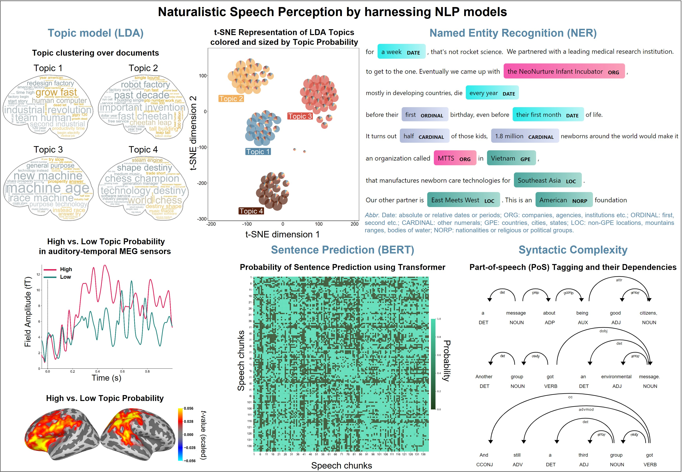

# Naturalistic Speech Perception and NLP
### Project in progress
We are investigating neural mechanisms during naturalistic audiovisual speech perception by harnessing Natural Language Processing (NLP) techniques and and Large Language Models (LLMs).  

